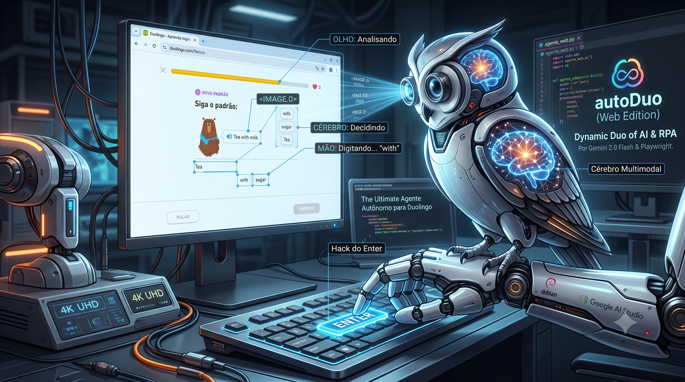

# 🦉 autoDuo



Bem-vindo ao **autoDuo**, um agente autônomo movido a Inteligência Artificial (Visão Computacional) que joga Duolingo diretamente no seu navegador.

Feito para rodar liso no desktop, este projeto abandonou as dores de cabeça de automação mobile e foca em uma abordagem direta e moderna: o robô **lê a tela como um humano** usando o Gemini 2.0 e executa as ações usando Playwright. Desenvolvido com muita dedicação, código limpo e a fé de que a automação perfeita existe! 🙏

## 🚀 Funcionalidades

* **Cérebro Multimodal:** Esqueça inspecionar código HTML que quebra a cada atualização. O robô tira prints invisíveis da tela e usa IA para decidir a melhor ação com base na imagem real.
* **Mão Ágil (Playwright):** Clica nos botões e tem habilidade para **digitar textos** nativamente em exercícios de tradução escrita.
* **Hack do Enter:** Usa o teclado virtual para avançar telas de acerto/erro instantaneamente, sem precisar caçar botões ocultos.
* **Sessão Persistente:** Você só faz login no Duolingo uma vez. O Playwright salva seu perfil localmente e já entra logado nas próximas vezes.

## 🛠️ Tecnologias Utilizadas

* [Python 3](https://www.python.org/)
* [Playwright](https://playwright.dev/python/) (Automação Web e injeção de comandos)
* [Google GenAI SDK](https://ai.google.dev/) (Motor cognitivo usando o novíssimo Gemini 2.0 Flash)

## ⚙️ Instalação (Debian / Linux)

1. **Prepare seu ambiente virtual:**
   ```bash
   python3 -m venv .venv
   source .venv/bin/activate